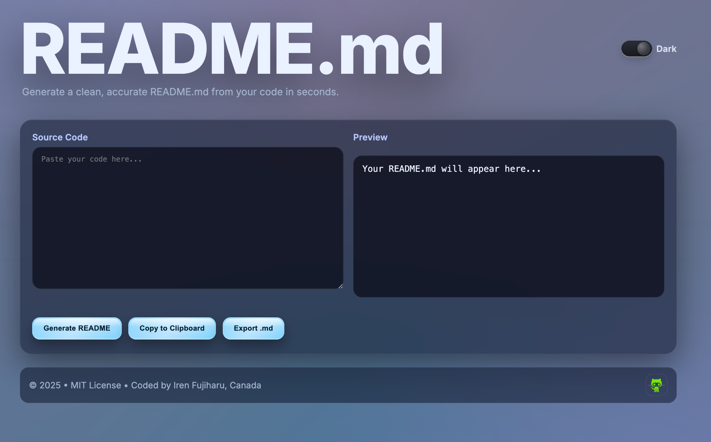
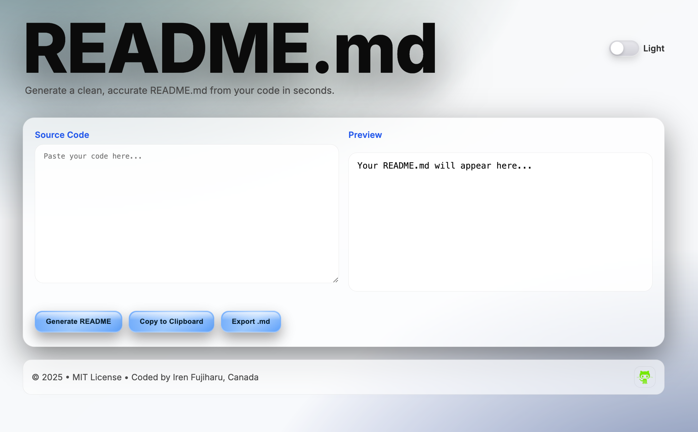

# README.md Generator

A modern developer tool that generates clean, accurate README.md files from your source code in seconds, saving time, avoiding errors, and boosting developer productivity.

## ✨ Features
- **Light/Dark Mode** toggle with ambient gradient background.
- Sleek, responsive glass-style UI.
- **Generate README.md** instantly from pasted code.
- Copy to clipboard or download as `.md` file.
- Fully responsive layout.

## 🚀 Usage
1. Paste your source code in the left pane.
2. Click **Generate README**.
3. Copy or export your generated README.md.

## 🛠 Tech Stack
- **HTML5**
- **CSS3** (Glassmorphism, responsive design)
- **JavaScript** (Frontend logic)
- **OpenAI API** (via backend server)

